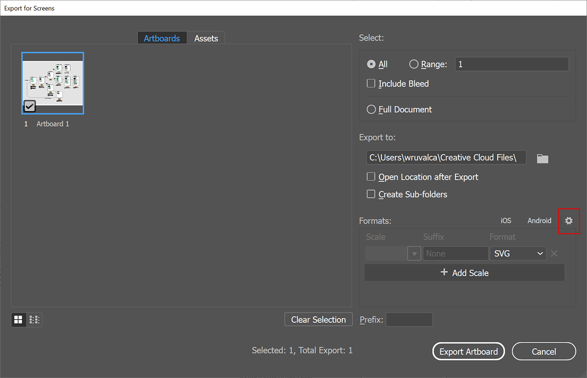
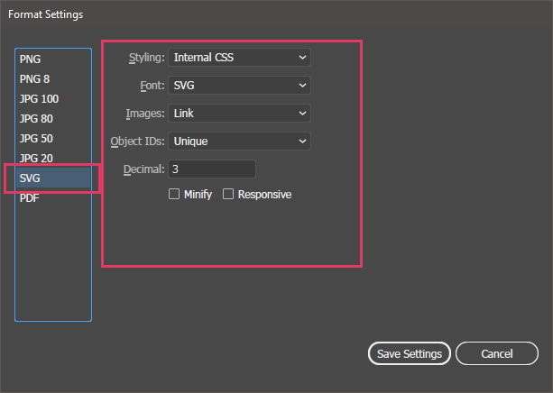

# Red Hat Diagrams in SVG

> For any questions or help, please contact wesruv@redhat.com & cpfed@redhat.com

This repo is to facilitate collaboration on diagram content via git, and to create production ready SVG's.

Collaboration should happen in the `source` folder, get the optimized SVG from the `for-web/` folder.

## Adding SVGs
SVG's should be saved from Illustrator using the following steps:

1. Save out SVG by going to File > Export > Export for Screens
2. Make sure it's exporting an SVG in the right column
3. Go to the Export Settings by clicking on the gear above the export types
  
4. Click SVG in the left column, then reproduce these settings:
  
5. Save Settings and Export `@todo filenaming convention?`
6. Repeat steps 1 - 5, but this time in the Export settings set "Font" to "SVG" `@todo filenaming convention`
7. For a new diagram create a new folder in this project under `source/` `@todo folder naming convention`
8. Create a `data.yml` file and add the follow text, feel free to add any information you know:
```yml
name:
request:
alt_text:
related_products:
```
9. Commit update (which should run SVG optimization and add it to `for-web/`)
10. Push up result

## Getting setup to optimize SVGs

> ! These instructions are written for Linux and Mac

First install Node JS on your system: https://nodejs.org/en/download/

Then open a terminal window, navigate to this folder and run:
```shell
npm install
```

This will install the tools needed to optimize the SVGs

### Enabling automatic SVG optimization
To enable SVG optimization on every git commit (on your machine) run these two commands in this folder from the terminal:

```shell
cp .git-hooks/* .git/hooks/
chmod +x .git/hooks/*
```

This adds some commands that will run pre and post git commit to automatically optimize the SVG's for you.

### Running SVG optimization manually
Run this command at any time to optimize all of the SVG's in the `source/` folder, the result will be added to `for-web/`:

```shell
npm run build
```